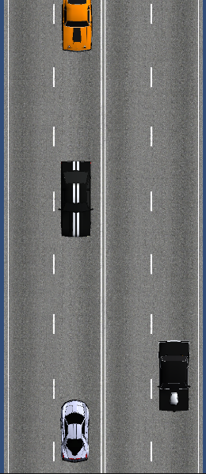
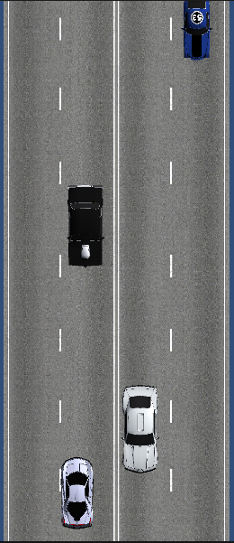

# Faster #

Here you can find a copy of the mobile game Faster. 
More detailed information about the implementation can be found below.

### Features of implementation ###

* There are 3 states in the game.
	1. Start screen application
	2. Game Level Screen
	3. Screen the result of passing the level.
* Ability to collect points
* A coin counter has been points.
	The number of points is kept between sessions.
* On the result screen has been implemented.
	The record counter. The record is kept between sessions.
* The scene where the game starts is called Main.
* Assets for characters and surrounding objects taken from the Asset Store.
* Unity version: `2019.4.17f1`.

